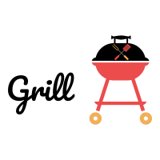

# Grill



Grill is not another bootstrap, but a **mobile first**, **CSS-only** library based on Grid Layout and written in Sass, intended for quickly making layouts.
Many CSS frameworks out there do too much, my main goal is to keep it stripped down to the minimum possible. 

## Table of Contents

- [Usage](#usage)
- [Grid Classes](#grid-classes)
- [Spacing classes](#spacing-classes)
- [Breakpoints](#breakpoints)
- [Implicit grid](#implicit-grid)
- [Accessibility](#accessibility)
- [Units](#units)
- [Color classes](#color-classes)
- [Colors](#colors)
- [Icons](#icons)

## Usage

Because of the way grid works, you don't need two levels of html containers to tell 'Hey, I'm a row' and then another one to say 'Hey, I also have columns!'. In Grill, you declare the number of columns directly on the top-level container. Every direct child will behave as a column, but you can still decide how many columns it will span. Nevertheless, since grids can be nested, any child of a grid container can also be a grid, having the `grid` class name on it and thus including its own columns declaration. I suggest you to read [this very comprehensive article](https://css-tricks.com/snippets/css/complete-guide-grid/) to better understand the great power and benefits of CSS Grid.

## Grid classes

- **grid**: Tells an HTML element to become a grid container:

- **cols**: (From 1 to 12), defines how many columns the grid will have. You can also add the breakpoint from which it will start having that number of columns. For example:

``` html
<div class="grid cols-2-sm cols-4-md cols-6-lg cols-8-xl"></div>
```

- **rows**: (From 1 to 12), defines how many rows the grid will have (though I don't encourage limiting this, I prefer setting the number of columns and leave the rows generate automatically). You can also add the breakpoint from which it will start having that number of rows. For example:

``` html
<div class="grid rows-8-sm rows-6-md rows-4-lg rows-2-xl"></div>
```

- **gap**: The grid gutter, in `rem` units, from 1 to 5. Psst! You can add the `-half` suffix to indicate a half of the given number (it'll only work with odd numbers for obvious reasons). E.g.: `gap-3-half`, `gap-x-3-half` or `gap-y-3-half`.

``` html
<div class="grid cols-2-sm cols-4-md cols-6-lg cols-8-xl gap-3"></div>
```

- **gap-x**: Sets the size of the gaps in the horizontal axis.

``` html
<div class="grid cols-2-sm cols-4-md cols-6-lg cols-8-xl gap-x-3"></div>
```

- **gap-y**: Sets the size of the gaps in the vertical axis.

``` html
<div class="grid cols-2-sm cols-4-md cols-6-lg cols-8-xl gap-y-3"></div>
```

- **grid-flow**: `-column` or `-row`, though "row" is the default value, it specifies how elements within the grid are going to flow.

``` html
<div class="grid grid-flow-column cols-2-sm cols-4-md cols-6-lg cols-8-xl gap-3-half"></div>
```

- **colspan**: tells a row how many columns must span. It also accepts explicit breakpoints.

``` html
<div class="colspan-4-md colspan-6-lg"></div>
```

or, for all screen sizes:

``` html
<div class="colspan-6"></div>
```

- **rowspan**: tells a column how many rows must span. It also accepts explicit breakpoints.

``` html
<div class="rowspan-4-md rowspan-6-lg"></div>
```

or, for all screen sizes:

``` html
<div class="rowspan-6"></div>
```

- **align-items**: `-stretch`, `-start`, `-center` or `-end`, specifies how elements within the grid will be aligned
 in the vertical axis.

- **justify-items**: `-stretch`, `-start`, `-center` or `-end`, specifies how elements within the grid will be aligned in the horizontal axis.

- **align-self**: `-stretch`, `-start`, `-center` or `-end`, specifies how a child element will be aligned in the
 vertical axis.

- **justify-self**: `-stretch`, `-start`, `-center` or `-end`, specifies how a child element will be aligned in the horizontal axis.


## Spacing classes

- **m-auto**: Auto margin (all axis)

- **mx-auto**: Auto margin (horizontal axis)

- **my-auto**: Auto margin (vertical axis)

### All the following accept breakpoint suffix

- **m-**: Margin from 0 to 5 (all axis).

- **mx-**: Margin from 0 to 5 (horizontal axis).

- **my-**: Margin from 0 to 5 (vertical axis).

- **mt-**: Margin top from 0 to 5

- **mb-**: Margin bottom from 0 to 5

- **ml-**: Margin left from 0 to 5

- **mr-**: Margin right from 0 to 5

- **p-**: Padding from 0 to 5 (all axis)

- **px-**: Padding from 0 to 5 (horizontal axis)

- **py-**: Padding from 0 to 5 (vertical axis)

- **pt-**: Padding top from 0 to 5

- **pb-**: Padding bottom from 0 to 5

- **pl-**: Padding left from 0 to 5

- **pr-**: Padding right from 0 to 5

## Breakpoints

- **-sm**: Starting from 600px

- **-md**: Starting from 960px

- **-lg**: Starting from 1280px

- **-xl**: Starting from 1440px

- **-xxl**: Starting from 1920px


## Implicit grid

- If you don't use any breakpoint at all, for example `<div class="grid cols-2"></div>`, it'll assume 2 columns for all screen sizes.
- If you include a class without an explicit breakpoint and another which does have it, the first one will apply for any screen size below the one indicated by the first breakpoint it encounters. For example `<div class="grid cols-2 cols-6-lg"></div>`, the grid will have 2 columns until 1280px and 6 columns starting from that resolution.
- Because the default number of columns and rows is 1, if you only use the breakpoint declarations it'll assume 1 column/row until the first given breakpoint. For example `<div class="grid cols-6-lg"></div>` will have 1 column until 1280px and then it'll have 6 columns.

## Accessibility

- **sr-only**: Using this class the element will be hidden to the GUI user but still accessible to screen readers.

## Units

All units are in `rem` but as I mentioned before, you can add `-half` suffix to reduce them to half.

## Color classes

This is optional and does not come in the default bundle. You have to uncomment the theme import in the `main.scss` file and compile manually.

- **text-**: Text color (`primary`, `success`, `warning`, `danger`, `dark`, `darker` or `light`)

- **bg-**: Background color (`primary`, `success`, `warning`, `danger`, `dark`, `darker` or `light`)


## Colors

This is optional and does not come in the default bundle. You have to uncomment the theme import in the `main.scss` file and compile manually.

- **primary**: #0b6daa;
- **success**: #00923f;
- **warning**: #f4ae00;
- **danger**: #cd2a21;
- **dark**: #222222;
- **darker**: #3d3d3d;
- **light**: #d1d3d4;

## Icons

Grill uses material icons, check [the official site](https://material.io/tools/icons/?style=baseline) for the glyph codes. All classes are prefixed with `icon-` followed by the icon code and must be accompanied by the `icon` class. For example:

``` html
<span class="icon icon-museum"></span>
```

### Attention

To reduce the bundle size, icons are not enabled by default. If you still want them you'll have to go to scss/base/base-dir.scss, uncomment the line that has the icons import and compile again. Don't forget to include the `icons` folder in your project.

**Have Grill saved your day? I'd be thankful if you [buy me a coffee](https://paypal.me/adrianbenavente). If you can't, a star would motivate me. I'm also at [Patreon](https://patreon.com/fenavente)**
